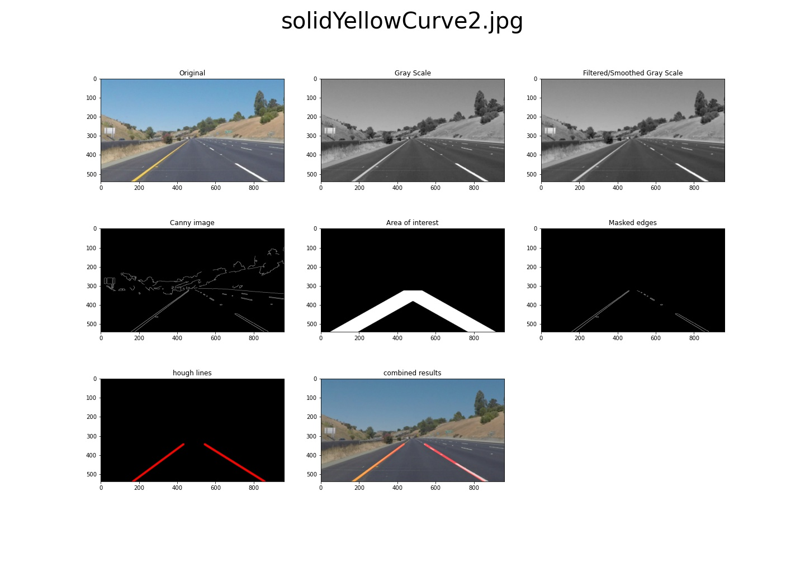

# **Finding Lane Lines on the Road** 


<center>
    
</center>


---

## Finding Lane Lines on the Road

The goals / steps of this project are the following:
* Make a pipeline that finds lane lines on the road using images from [./test_images](https://github.com/Mohamed-Abdulaty/UDACITY-CarND-P1-FindingLaneLines/tree/development/test_images)
* Generate the result of drawing the lane lines on the images to [./test_images_output](https://github.com/Mohamed-Abdulaty/UDACITY-CarND-P1-FindingLaneLines/tree/development/test_images_output)
* **Additionally**, i have added multiple images that helps me during the development to [./test_images_debugging](https://github.com/Mohamed-Abdulaty/UDACITY-CarND-P1-FindingLaneLines/tree/development/test_images_debugging)
* Apply the developed pipeline to two vedios from [./test_videos](https://github.com/Mohamed-Abdulaty/UDACITY-CarND-P1-FindingLaneLines/tree/development/test_videos), and generate result to [./test_videos_output](https://github.com/Mohamed-Abdulaty/UDACITY-CarND-P1-FindingLaneLines/tree/development/test_videos_output)
* Reflect of the done work in a written report.

---

## Reflection

- lets start from this figure and go through each cell with description. 
<center>
    
</center>


## 1. The pipeline description:
### **The pipeline consisted of 5 steps** 

1. Converting the original image to grayscal as seen in upper-middel image.
    * ```python 
      # Switching to gray scale
      gray_image = grayscale(current_image)
      ```
2. Smoothing the grayscaled image with tha aid of gaussian filter as seen in the upper-right image.
    * ```python
      # Apply Gaussian smoothing
      smoothing_kernal_size = 5
      smoothed_image = gaussian_blur(gray_image, smoothing_kernal_size)
      ```
3. Using Canny transformation in order to detect all the edges in the image as seen in the middle-left image
    * ```python
      # Apply Canny Transform to get the edges in the image
      low_threshold = 50
      high_threshold= 150
      edges_image = canny(smoothed_image, low_threshold, high_threshold)
      ```
4. Using the HOUGH to determine only the lines/area of interest as seen in both middle-middle image (area of interest), and in the middle-right image after applying the mask.
    * ```python
      # Selecting the area of interest
        imshape = edges_image.shape
        xsize, ysize = imshape[1], imshape[0]                   # Get the image size
        vertices = np.array([[  (0.05*xsize,    ysize),         # P1
                                (0.45*xsize,    ysize*0.60),    # P2
                                (0.55*xsize,    ysize*0.60),    # P3
                                (0.95*xsize,    ysize),         # P4
                                (0.80*xsize,    ysize),         # P5 
                                (0.50*xsize,    ysize*0.70),    # P6
                                (0.20*xsize,    ysize)          # P7
                        ]], dtype=np.int32)
        
        masked_edges_image, area_of_interest = region_of_interest(edges_image, vertices)

        # Apply Hough on edge detected image
        ρ, Θ = 3, np.pi/180
        threshold = 100
        min_line_len = 25
        max_line_gap = 25
        hough_lines_image = hough_lines(masked_edges_image, 
                                        ρ, 
                                        Θ, 
                                        threshold, 
                                        min_line_len, 
                                        max_line_gap)
      ```
5. Drawing the Lane Lines on the Original Image
    * ```python
      # combined result
      combined_image = weighted_img(hough_lines_image, current_image)
      ```

* **draw_lines function modifications:**
    * ```python 
      def draw_lines(image, lines, color=[255, 0, 0], thickness=10):
        
          # Reshape the lines into a line based matrix
          lines = lines.reshape(lines.shape[0], lines.shape[2])
        
          # Select all right lane lines
          right_lines = list(filter(lambda x: get_line_slope(x) > 0, lines))
          ## Set restriction on the slope range
          right_lines = list(filter(lambda x: get_line_slope(x) > 0.2, right_lines))
          right_lines = list(filter(lambda x: get_line_slope(x) < 0.8, right_lines))
          # Reconstruct the lines in a list of lists format
          right_lines = list(map(list,right_lines))
        
          # Select all left lane lines
          left_lines = list(filter(lambda x: get_line_slope(x) < 0, lines))
          ## Set restriction on the slope range
          left_lines = list(filter(lambda x: get_line_slope(x) > -0.8, left_lines))
          left_lines = list(filter(lambda x: get_line_slope(x) < -0.2, left_lines))
          # Reconstruct the lines in a list of lists format
          left_lines = list(map(list,left_lines))
        
          # using the weighted average to draw avg line
          draw_avg_line(image, right_lines, color, thickness)
          draw_avg_line(image, left_lines , color, thickness)
        
          return

      def get_line_slope(line):
          # (Y2 - Y1) / (X2 - X1)
          return (line[3] - line[1])/(line[2] - line[0])

      def draw_avg_line(image, lines, color, thickness, ):
          # using the weighted average
          avg_line =  np.average(lines, axis=0)
        
          if np.isnan(avg_line).any():
              # No line detected.
              return
            
          # extent short lines to the bounderies of AoI
          coefficients = np.polyfit((avg_line[0], avg_line[2]), (avg_line[1], avg_line[3]), 1)
          m, b = coefficients[0], coefficients[1]

          y1 = image.shape[0] # Max value on Y-axis
          x1 = (y1 - b)/m     # From the line equation Y = mX + b

          y2 = y1*0.64        # match the value with area of interest
          x2 = (y2 - b)/m     # From the line equation Y = mX + b

          cv2.line(image, (int(x1), int(y1)), (int(x2), int(y2)), color, thickness)
          return
      ```

## 2. Identify potential shortcomings with your current pipeline

*  One potential shortcoming would be the pipeline could draw some strange lane lines when there are some shadows of trees or others in the test images.

*  Another shortcomming would be the urge to use curve instad of line draw.


## 3. Suggest possible improvements to your pipeline

* A possible improvement would be to use advanced OpenCV techniques, such as Sobel operator, HLS or HSV color spaces and so on. Which normally can solve the challenge part easily.

* Another potential improvement could be to use Convolutional Neural Network or other Deep Learning methods to create a semantic segmentation solution for detecting lane lines.